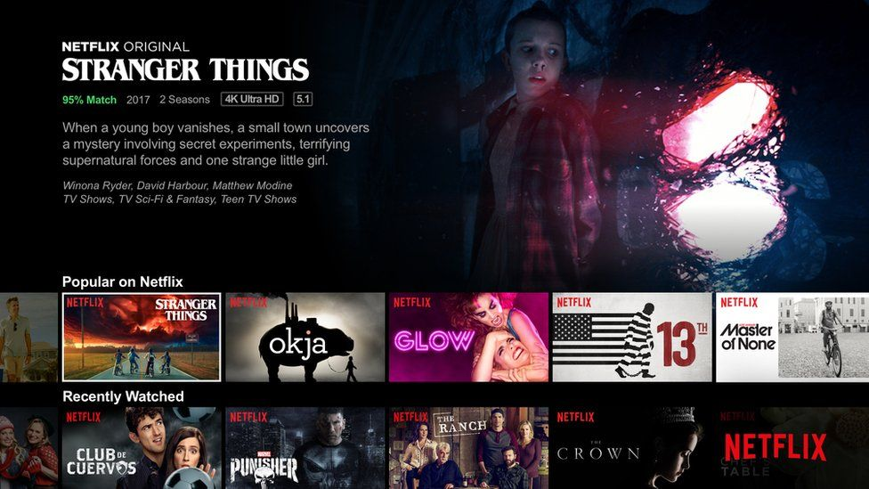

# Netflix Movies and TV Shows Data Analysis using SQL

 VIEW(pgAdmin 4.png)

## OBJECTIVE
Analyze the distribution of content types (movies vs TV shows).
Identify the most common ratings for movies and TV shows.
List and analyze content based on release years, countries, and durations.
Explore and categorize content based on specific criteria and keywords.

## SCHEMAS 

CREATE TABLE netflix
(                
    show_id      VARCHAR(5),
    type         VARCHAR(10),
    title        VARCHAR(250),
    director     VARCHAR(550),
    casts        VARCHAR(1050),
    country      VARCHAR(550),
    date_added   VARCHAR(55),
    release_year INT,
    rating       VARCHAR(15),
    duration     VARCHAR(15),
    listed_in    VARCHAR(250),
    description  VARCHAR(550)
);

## DATSEET 
Dataset of this movie- neflix project.sql

## Conclusion
Content Distribution: The dataset contains a diverse range of movies and TV shows with varying ratings and genres.
Common Ratings: Insights into the most common ratings provide an understanding of the content's target audience.
Geographical Insights: The top countries and the average content releases by India highlight regional content distribution.
Content Categorization: Categorizing content based on specific keywords helps in understanding the nature of content available on Netflix.

